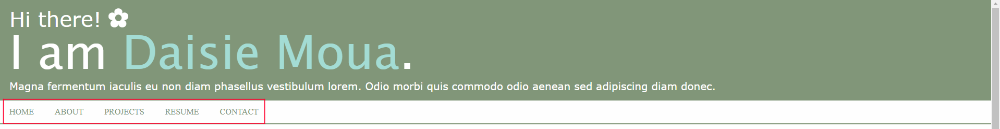
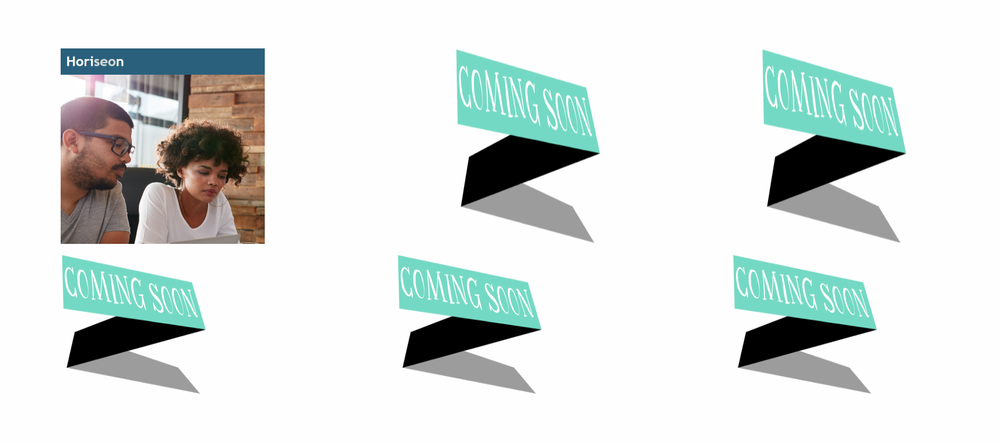
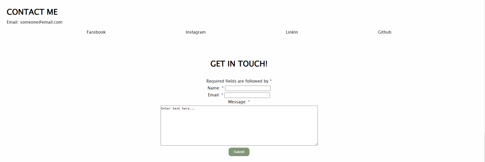

# Personal Portfolio

## Description

The goal of the website is to provide a well-developed portfolio displaying my own personal work experiences, completed projects, in-progress projects, resume, and contact information to allow potential employers to assess whether I am a good candidate for an open position. This website helps me to organize all my work and display it in one website for anyone to visit to see my work. Through this process, I was able to learn how to better webframe a website from scratch and learn how each code work together.

## Table of Contents (Optional)

- [Installation](#installation)
- [Usage](#usage)
- [Credits](#credits)
- [License](#license)
- [Code Source](#code-source)

## Installation

N/A

## Usage

When the user enters into the website, they will see a navigation bar located on the top of the page. Displayed is; Home, About, Projects, Resume, and Contact. By clicking on any of the buttons, the user will be automactically directed to a part of the webpage that will display the information of that bar. Example can be seen below.

    ```md
    
    ```
    

When the user enter in the project section, there are images displayed that can be clicked on. When clicked, the user will be directed to the hyperlink connected to the image into another browser where they can view the project website.

    ```md
    
    ```

When the user enters the contact section, they will see an email and social links. The user is able to click on the social names to be directed to the provided social link. Below the social links is a quick and easy way to contact the website owner by leaving a message. 

    ```md
    
    ``

## Credits

N/A

## License

N/A

## Code Source

The code for the challenge can be found in the following file:

- [index.html](/src/index.html): Contains the HTML structure of the landing page.

- [style.css](/src/style.css): Contains the CSS styles for the landing page.

- [index.html](/src/index.html) LINE 129 - 151: Based on the work of [Mozilla Contributors](https://developer.mozilla.org/en-US/docs/Learn/Forms/How_to_structure_a_web_form)

```
    html
    /* Code adapted from Mozilla Contributors's original work */
    /* line 162 - 166 */
    <secion class="enter">
            <p>
                <button class="button-style" type="submit"> Submit </button>
            </p>
        </secion>

- [index.html](/src/index.html) LINE 156 - 159: Based on the work of [Anna Fitzgerald](https://blog.hubspot.com/website/html-text-box)

```
    html
    /* Code adapted from Anna Fitzgerald's original work */
    /* line 156 - 159 */
    <br>
                <textarea name="freeform" rows="10" cols="80">
Enter text here...
                </textarea>
```

- [index.html](/src/index.html) LINE 162 - 166: Based on the work of [Mozilla Contributors](https://developer.mozilla.org/en-US/docs/Web/HTML/Element/button)

```
    html
    /* Code adapted from Mozilla Contributors
    's original work */
    /* line 162 - 166 */
    <secion class="enter">
            <p>
                <button class="button-style" type="submit"> Submit </button>
            </p>
        </secion>
```

- [index.html](/src/index.html) LINE 162 - 166: Based on the work of [Mozilla Contributors](https://developer.mozilla.org/en-US/docs/Web/HTML/Element/button)

```
    html
    /* Code adapted from Mozilla Contributors
    's original work */
    /* line 162 - 166 */
    <secion class="enter">
            <p>
                <button class="button-style" type="submit"> Submit </button>
            </p>
        </secion>
```

## Badges

N/A

## Features

N/A

## How to Contribute

N/A

## Tests

N/A